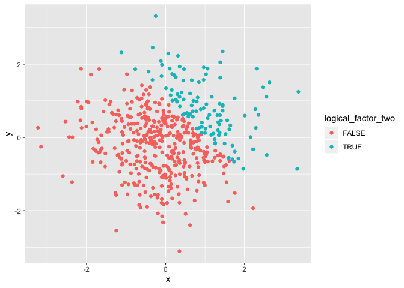

p8105\_hw1\_qy2234
================
Michael Yan
9/13/2019

## Problem 1

  - Section 1

<!-- end list -->

``` r
## load the tidyverse package
library(tidyverse)
```

    ## ── Attaching packages ───────────────────────────────────────────── tidyverse 1.2.1 ──

    ## ✔ ggplot2 3.2.1     ✔ purrr   0.3.2
    ## ✔ tibble  2.1.3     ✔ dplyr   0.8.3
    ## ✔ tidyr   0.8.3     ✔ stringr 1.4.0
    ## ✔ readr   1.3.1     ✔ forcats 0.4.0

    ## ── Conflicts ──────────────────────────────────────────────── tidyverse_conflicts() ──
    ## ✖ dplyr::filter() masks stats::filter()
    ## ✖ dplyr::lag()    masks stats::lag()

``` r
## create data frame
df_one = tibble(
  ramdom_sample = rnorm(8),
  logical_vector = ramdom_sample > 0,
  character_vector = c(
  "CORONARY ARTERY DISEASE (CAD)",
  "STROKE",
  "LOWER RESPIRATORY INFECTIONS (LRI)",
  "CHRONIC OBSTRUCTIVE PULMONARY DISEASE (COPD)",
  "DIARRHEAL DISEASES",
  "HIV/AIDS",
  "RESPIRATORY CANCERS",
  "TUBERCULOSIS"
  ),
  factor_vector = factor(c(
  "severe",
  "moderate",
  "mild",
  "mild",
  "severe",
  "moderate",
  "moderate",
  "moderate"
  ))
)

## take the mean of each variable in the dataframe
ramdom_sample_mean = mean(pull(df_one, ramdom_sample))
logical_vector_mean = mean(pull(df_one, logical_vector))
character_vector_mean = mean(pull(df_one, character_vector))
```

    ## Warning in mean.default(pull(df_one, character_vector)): argument is not
    ## numeric or logical: returning NA

``` r
factor_vector_mean = mean(pull(df_one, factor_vector))
```

    ## Warning in mean.default(pull(df_one, factor_vector)): argument is not
    ## numeric or logical: returning NA

### Observation: It worked only for ramdom\_sample and logical\_vector since both of them can be represented by numbers while character\_vector and factor\_vector can not be represented by numbers.

  - Section
2

<!-- end list -->

``` r
## convert the logical vector to numeric, and multiply the random sample by the result
as.numeric(pull(df_one, logical_vector))
```

    ## [1] 1 1 1 0 1 0 1 0

``` r
product_rs_lv_numeric = pull(df_one, logical_vector) * 
  pull(df_one, ramdom_sample)
product_rs_lv_numeric
```

    ## [1] 0.72577030 0.09187142 0.34142293 0.00000000 0.10083496 0.00000000
    ## [7] 0.50598354 0.00000000

``` r
## convert the logical vector to a factor, and multiply the random sample by the result
as.factor(pull(df_one, logical_vector))
```

    ## [1] TRUE  TRUE  TRUE  FALSE TRUE  FALSE TRUE  FALSE
    ## Levels: FALSE TRUE

``` r
product_rs_lv_factor = pull(df_one, logical_vector) * 
  pull(df_one, ramdom_sample)
product_rs_lv_factor
```

    ## [1] 0.72577030 0.09187142 0.34142293 0.00000000 0.10083496 0.00000000
    ## [7] 0.50598354 0.00000000

``` r
## convert the logical vector to a factor and then convert the result to numeric, and multiply the random sample by the result
as.factor(pull(df_one, logical_vector))
```

    ## [1] TRUE  TRUE  TRUE  FALSE TRUE  FALSE TRUE  FALSE
    ## Levels: FALSE TRUE

``` r
as.numeric(pull(df_one, logical_vector))
```

    ## [1] 1 1 1 0 1 0 1 0

``` r
product_rs_lv_n_f = pull(df_one, logical_vector) * 
  pull(df_one, ramdom_sample)
product_rs_lv_n_f
```

    ## [1] 0.72577030 0.09187142 0.34142293 0.00000000 0.10083496 0.00000000
    ## [7] 0.50598354 0.00000000

## Problem 2

``` r
## load the tidyverse package
library(tidyverse)

## create data frame
df_two = tibble(
  x = rnorm(500),
  y = rnorm(500),
  logical_factor_two = x + y > 1
)

## change logical vector to numeric vector
logical_factor_two_numeric = as.numeric(pull(df_two, logical_factor_two))
logical_factor_two_numeric
```

    ##   [1] 0 0 1 0 1 1 0 0 0 0 0 0 0 0 1 0 1 0 1 0 0 0 1 1 0 0 0 0 0 0 0 1 0 0 0
    ##  [36] 0 0 1 0 0 0 0 0 0 1 0 0 1 1 1 0 0 0 1 0 0 0 0 0 0 1 0 0 0 0 1 0 0 0 0
    ##  [71] 1 0 0 0 0 0 0 0 1 0 1 0 1 0 0 1 1 1 0 0 0 0 0 0 1 0 0 0 0 1 1 0 0 1 0
    ## [106] 0 1 1 0 0 1 1 1 0 0 0 0 0 0 0 1 0 1 0 0 1 0 0 0 0 0 1 1 0 0 0 0 0 0 0
    ## [141] 0 0 1 0 0 0 1 0 0 1 1 0 1 0 0 0 1 1 0 1 0 1 1 0 0 0 0 0 1 0 1 0 0 0 0
    ## [176] 0 0 0 0 0 0 0 0 0 0 0 0 1 0 0 0 0 0 0 0 0 0 0 1 0 0 0 0 0 0 0 1 1 0 0
    ## [211] 0 0 0 0 0 0 0 0 0 0 0 0 0 0 1 0 0 0 0 0 1 0 1 0 0 0 0 1 0 0 0 0 0 0 0
    ## [246] 1 1 0 0 0 0 0 0 0 0 0 0 0 1 0 1 0 0 0 1 0 0 0 0 0 1 1 1 0 0 0 0 1 0 0
    ## [281] 0 0 0 0 0 0 0 0 0 0 0 0 0 0 1 0 1 0 0 0 1 0 0 0 0 0 0 0 0 0 0 1 0 0 0
    ## [316] 0 0 1 0 0 0 0 1 1 0 1 0 0 0 0 1 0 1 0 0 0 0 0 0 1 1 0 0 0 0 0 0 0 0 0
    ## [351] 0 0 0 0 0 0 0 0 0 0 0 0 0 0 1 0 1 0 0 1 0 1 1 1 0 0 1 1 1 1 0 0 0 1 0
    ## [386] 0 0 0 0 0 0 0 0 0 0 0 0 0 1 0 1 0 0 0 0 0 0 0 0 0 1 1 0 0 0 1 0 0 0 0
    ## [421] 1 0 0 0 0 0 0 0 0 0 0 0 0 0 0 0 0 0 0 0 0 0 0 0 1 0 0 0 0 0 0 0 1 0 1
    ## [456] 0 0 0 0 0 0 0 1 0 0 1 0 0 1 1 0 0 1 1 0 0 0 1 0 0 0 1 0 0 1 1 0 0 0 0
    ## [491] 0 0 0 0 0 0 0 1 0 0

``` r
## change logical vector to factor vector
logical_factor_two_factor = as.factor(pull(df_two, logical_factor_two))
logical_factor_two_factor
```

    ##   [1] FALSE FALSE TRUE  FALSE TRUE  TRUE  FALSE FALSE FALSE FALSE FALSE
    ##  [12] FALSE FALSE FALSE TRUE  FALSE TRUE  FALSE TRUE  FALSE FALSE FALSE
    ##  [23] TRUE  TRUE  FALSE FALSE FALSE FALSE FALSE FALSE FALSE TRUE  FALSE
    ##  [34] FALSE FALSE FALSE FALSE TRUE  FALSE FALSE FALSE FALSE FALSE FALSE
    ##  [45] TRUE  FALSE FALSE TRUE  TRUE  TRUE  FALSE FALSE FALSE TRUE  FALSE
    ##  [56] FALSE FALSE FALSE FALSE FALSE TRUE  FALSE FALSE FALSE FALSE TRUE 
    ##  [67] FALSE FALSE FALSE FALSE TRUE  FALSE FALSE FALSE FALSE FALSE FALSE
    ##  [78] FALSE TRUE  FALSE TRUE  FALSE TRUE  FALSE FALSE TRUE  TRUE  TRUE 
    ##  [89] FALSE FALSE FALSE FALSE FALSE FALSE TRUE  FALSE FALSE FALSE FALSE
    ## [100] TRUE  TRUE  FALSE FALSE TRUE  FALSE FALSE TRUE  TRUE  FALSE FALSE
    ## [111] TRUE  TRUE  TRUE  FALSE FALSE FALSE FALSE FALSE FALSE FALSE TRUE 
    ## [122] FALSE TRUE  FALSE FALSE TRUE  FALSE FALSE FALSE FALSE FALSE TRUE 
    ## [133] TRUE  FALSE FALSE FALSE FALSE FALSE FALSE FALSE FALSE FALSE TRUE 
    ## [144] FALSE FALSE FALSE TRUE  FALSE FALSE TRUE  TRUE  FALSE TRUE  FALSE
    ## [155] FALSE FALSE TRUE  TRUE  FALSE TRUE  FALSE TRUE  TRUE  FALSE FALSE
    ## [166] FALSE FALSE FALSE TRUE  FALSE TRUE  FALSE FALSE FALSE FALSE FALSE
    ## [177] FALSE FALSE FALSE FALSE FALSE FALSE FALSE FALSE FALSE FALSE FALSE
    ## [188] TRUE  FALSE FALSE FALSE FALSE FALSE FALSE FALSE FALSE FALSE FALSE
    ## [199] TRUE  FALSE FALSE FALSE FALSE FALSE FALSE FALSE TRUE  TRUE  FALSE
    ## [210] FALSE FALSE FALSE FALSE FALSE FALSE FALSE FALSE FALSE FALSE FALSE
    ## [221] FALSE FALSE FALSE FALSE TRUE  FALSE FALSE FALSE FALSE FALSE TRUE 
    ## [232] FALSE TRUE  FALSE FALSE FALSE FALSE TRUE  FALSE FALSE FALSE FALSE
    ## [243] FALSE FALSE FALSE TRUE  TRUE  FALSE FALSE FALSE FALSE FALSE FALSE
    ## [254] FALSE FALSE FALSE FALSE FALSE TRUE  FALSE TRUE  FALSE FALSE FALSE
    ## [265] TRUE  FALSE FALSE FALSE FALSE FALSE TRUE  TRUE  TRUE  FALSE FALSE
    ## [276] FALSE FALSE TRUE  FALSE FALSE FALSE FALSE FALSE FALSE FALSE FALSE
    ## [287] FALSE FALSE FALSE FALSE FALSE FALSE FALSE FALSE TRUE  FALSE TRUE 
    ## [298] FALSE FALSE FALSE TRUE  FALSE FALSE FALSE FALSE FALSE FALSE FALSE
    ## [309] FALSE FALSE FALSE TRUE  FALSE FALSE FALSE FALSE FALSE TRUE  FALSE
    ## [320] FALSE FALSE FALSE TRUE  TRUE  FALSE TRUE  FALSE FALSE FALSE FALSE
    ## [331] TRUE  FALSE TRUE  FALSE FALSE FALSE FALSE FALSE FALSE TRUE  TRUE 
    ## [342] FALSE FALSE FALSE FALSE FALSE FALSE FALSE FALSE FALSE FALSE FALSE
    ## [353] FALSE FALSE FALSE FALSE FALSE FALSE FALSE FALSE FALSE FALSE FALSE
    ## [364] FALSE TRUE  FALSE TRUE  FALSE FALSE TRUE  FALSE TRUE  TRUE  TRUE 
    ## [375] FALSE FALSE TRUE  TRUE  TRUE  TRUE  FALSE FALSE FALSE TRUE  FALSE
    ## [386] FALSE FALSE FALSE FALSE FALSE FALSE FALSE FALSE FALSE FALSE FALSE
    ## [397] FALSE FALSE TRUE  FALSE TRUE  FALSE FALSE FALSE FALSE FALSE FALSE
    ## [408] FALSE FALSE FALSE TRUE  TRUE  FALSE FALSE FALSE TRUE  FALSE FALSE
    ## [419] FALSE FALSE TRUE  FALSE FALSE FALSE FALSE FALSE FALSE FALSE FALSE
    ## [430] FALSE FALSE FALSE FALSE FALSE FALSE FALSE FALSE FALSE FALSE FALSE
    ## [441] FALSE FALSE FALSE FALSE TRUE  FALSE FALSE FALSE FALSE FALSE FALSE
    ## [452] FALSE TRUE  FALSE TRUE  FALSE FALSE FALSE FALSE FALSE FALSE FALSE
    ## [463] TRUE  FALSE FALSE TRUE  FALSE FALSE TRUE  TRUE  FALSE FALSE TRUE 
    ## [474] TRUE  FALSE FALSE FALSE TRUE  FALSE FALSE FALSE TRUE  FALSE FALSE
    ## [485] TRUE  TRUE  FALSE FALSE FALSE FALSE FALSE FALSE FALSE FALSE FALSE
    ## [496] FALSE FALSE TRUE  FALSE FALSE
    ## Levels: FALSE TRUE

### a short description of the vector

*The size of the dataset is 500 by 3 * The mean of the sample is
0.0245825 \* The median of the sample is 0.0103183 \* The standard
deviation of the sample is 1.0142475 \* the proportion of cases for
which x + y \> 1 is 0.22

### scatterplot of y vs x

``` r
library(tidyverse)
## scatterplot using the logical variable, blue(green) means the sum of x and y exceeds 1
ggplot(df_two, aes(color = logical_factor_two, x = x, y = y)) + 
  geom_point()
```

<!-- -->

``` r
## scatterplot using the numeric variable, blue means the sum of x and y exceeds 1
ggplot(df_two, aes(color = logical_factor_two_numeric, x = x, y = y)) + 
  geom_point()
```

<!-- -->

``` r
## scatterplot using the factor variable, blue(green) means the sum of x and y exceeds 1
ggplot(df_two, aes(color = logical_factor_two_factor, x = x, y = y)) + 
  geom_point()
```

<!-- -->

``` r
## Export the first scatterplot to the project directory
ggsave("df_two.png")
```

    ## Saving 7 x 5 in image
